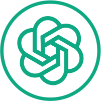
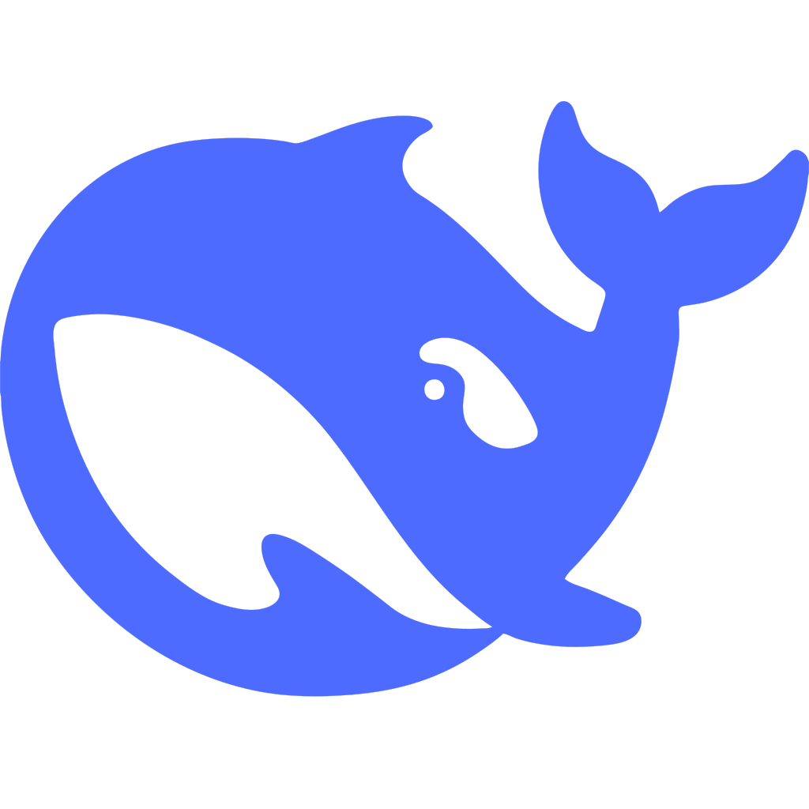
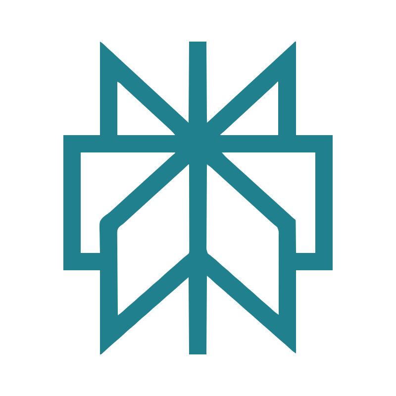
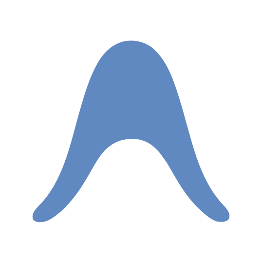
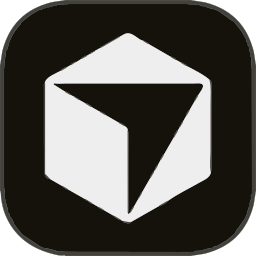
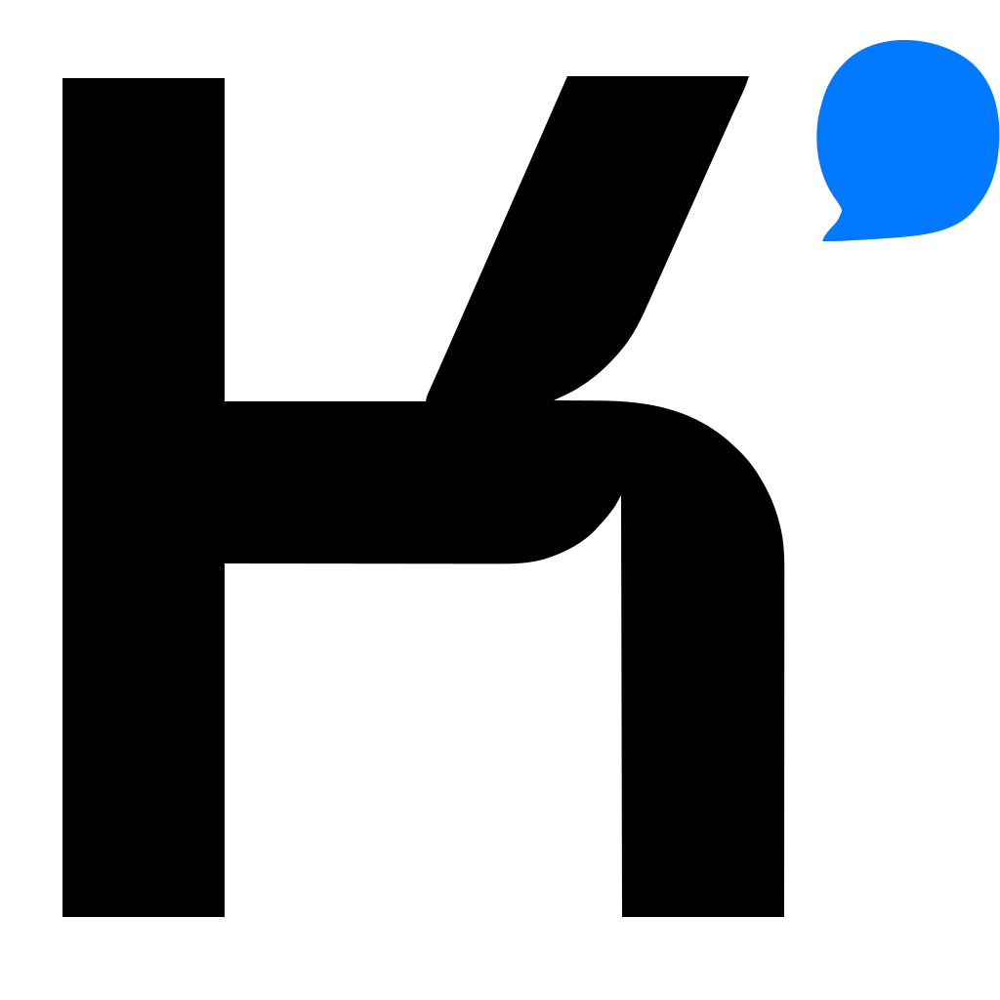
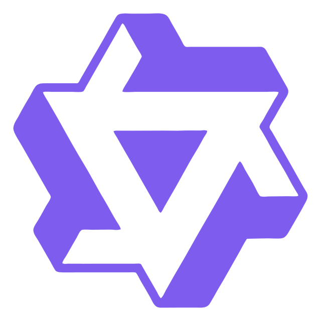
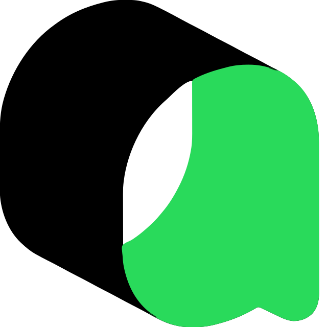

<!-- HERO BANNER WITH DYNAMIC LIGHT & DARK THEME SWITCHING -->

  
  

 

<!-- INTERACTIVE LIGHT / DARK MODE TOGGLE BUTTON -->

  

 

<!-- SWINGING LANYARD ID BADGE -->

  

<!-- DYNAMIC TYPING HEADER WITH LIGHT/DARK THEME SUPPORT -->

  <picture>
    <source media="(prefers-color-scheme: dark)" srcset="https://readme-typing-svg.demolab.com?font=Fira+Code&weight=700&size=26&duration=3000&pause=1000&color=00D4FF&center=true&vCenter=true&width=900&lines=Hi+%F0%9F%91%8B%2C+I'm+Hayat+Ali+(CodeWithHSquare);AI+Engineer+%7C+Full+Stack+Developer+%7C+ML+Engineer;Building+Autonomous+AI+Agents+%26+Production+RAG;Aiming+for+OpenAI+%7C+Google+DeepMind+%7C+Anthropic">
    <source media="(prefers-color-scheme: light)" srcset="https://readme-typing-svg.demolab.com?font=Fira+Code&weight=700&size=26&duration=3000&pause=1000&color=4F46E5&center=true&vCenter=true&width=900&lines=Hi+%F0%9F%91%8B%2C+I'm+Hayat+Ali+(CodeWithHSquare);AI+Engineer+%7C+Full+Stack+Developer+%7C+ML+Engineer;Building+Autonomous+AI+Agents+%26+Production+RAG;Aiming+for+OpenAI+%7C+Google+DeepMind+%7C+Anthropic">
    
  </picture>

<!-- SOCIAL & BRAND CONNECT BADGES -->

  
  
  
  
  

---

## 👤 About Me

 

<table>
  <tr>
    <td width="60%" valign="top">
      <h3>🚀 Who I Am</h3>
      <ul>
        <li>🎓 Final Year <strong>B.Tech in Computer Science Engineering</strong> from India.</li>
        <li>💡 Exploring <strong>Generative AI, Agentic AI (MCP), RAG Pipelines</strong>, and scalable <strong>Full Stack Applications</strong>.</li>
        <li>🧠 Obsessively solving <strong>Data Structures &amp; Algorithms (DSA)</strong> on LeetCode following <strong>Striver's A-Z DSA Sheet</strong>.</li>
        <li>📄 Authored a research review paper on <strong>NAND Gate Simulation using Adobe Flash</strong>.</li>
      </ul>
       
      
      &nbsp;
      
      &nbsp;
      
    </td>
    <td width="40%" align="center" valign="middle">
      <h3>🎯 Career Goals &amp; Target Labs</h3>
      
<i>Aiming for Global Tech &amp; AI Research Leaders</i>

      

        <strong>OpenAI</strong> • <strong>Google DeepMind</strong> 
        <strong>Anthropic</strong> • <strong>NVIDIA</strong> 
        <strong>Microsoft AI</strong> • <strong>Meta AI</strong> 
        <strong>Amazon AGI</strong> • <strong>Databricks</strong> 
        <strong>Snowflake</strong>
      

    </td>
  </tr>
</table>

---

## 🛠️ Tech Stack &amp; Tools

<!-- GitHub natively adapts icons to your theme. Toggle via GitHub Settings → Appearance -->

  <a href="https://github.com/settings/appearance" title="Click to toggle light/dark theme in GitHub settings">
    <!-- Dark mode indicator — visible in GitHub dark theme -->
    
    <!-- Light mode indicator — visible in GitHub light theme -->
    
  </a>

  💡 Toggle light/dark via <strong><a href="https://github.com/settings/appearance">GitHub → Settings → Appearance</a></strong>

<table align="center" width="100%">
  <!-- ROW 1: Web Core -->
  <tr>
    <td align="center" width="25%">
       
        
      <b>HTML</b>
        
    </td>
    <td align="center" width="25%">
       
        
      <b>CSS</b>
        
    </td>
    <td align="center" width="25%">
       
        
      <b>JavaScript</b>
        
    </td>
    <td align="center" width="25%">
       
        
      <b>Next.js</b>
        
    </td>
  </tr>

  <!-- ROW 2: Frontend Frameworks -->
  <tr>
    <td align="center" width="25%">
       
        
      <b>React.js</b>
        
    </td>
    <td align="center" width="25%">
       
        
      <b>Bootstrap</b>
        
    </td>
    <td align="center" width="25%">
       
        
      <b>Tailwind CSS</b>
        
    </td>
    <td align="center" width="25%">
       
        
      <b>Express.js</b>
        
    </td>
  </tr>

  <!-- ROW 3: Backend & DB -->
  <tr>
    <td align="center" width="25%">
       
        
      <b>MongoDB</b>
        
    </td>
    <td align="center" width="25%">
       
        
      <b>PHP</b>
        
    </td>
    <td align="center" width="25%">
       
        
      <b>MySQL</b>
        
    </td>
    <td align="center" width="25%">
       
        
      <b>Node.js</b>
        
    </td>
  </tr>

  <!-- ROW 4: Languages & Tools -->
  <tr>
    <td align="center" width="25%">
       
        
      <b>C / C++</b>
        
    </td>
    <td align="center" width="25%">
       
        
      <b>Python</b>
        
    </td>
    <td align="center" width="25%">
       
        
      <b>Git</b>
        
    </td>
    <td align="center" width="25%">
       
        
      <b>GitHub</b>
        
    </td>
  </tr>

  <!-- ROW 5: Dev Tools & IDEs -->
  <tr>
    <td align="center" width="25%">
       
        
      <b>VS Code</b>
        
    </td>
    <td align="center" width="25%">
       
        
      <b>PyCharm</b>
        
    </td>
    <td align="center" width="25%">
       
        
      <b>Anaconda</b>
        
    </td>
    <td align="center" width="25%">
       
        
      <b>Jupyter Notebook</b>
        
    </td>
  </tr>

  <!-- ROW 6: ML & AI Dev -->
  <tr>
    <td align="center" width="25%">
       
        
      <b>Machine Learning</b>
        
    </td>
    <td align="center" width="25%">
       
        
      <b>PyTorch</b>
        
    </td>
    <td align="center" width="25%">
       
        
      <b>Kaggle</b>
        
    </td>
    <td align="center" width="25%">
       
        
      <b>Firebase</b>
        
    </td>
  </tr>

  <!-- ROW 7: Deployment -->
  <tr>
    <td align="center" width="25%">
       
        
      <b>Vercel</b>
        
    </td>
    <td align="center" width="25%">
       
        
      <b>Netlify</b>
        
    </td>
    <td align="center" width="25%">
       
        
      <b>Replit</b>
        
    </td>
    <td align="center" width="25%">
       
        
      <b>Postman</b>
        
    </td>
  </tr>

  <!-- ROW 8: AI Tools — Major -->
  <tr>
    <td align="center" width="25%">
       
        
      <b>ChatGPT</b>
        
    </td>
    <td align="center" width="25%">
       
        
      <b>Claude</b>
        
    </td>
    <td align="center" width="25%">
       
        
      <b>Gemini</b>
        
    </td>
    <td align="center" width="25%">
       
        
      <b>GitHub Copilot</b>
        
    </td>
  </tr>

  <!-- ROW 9: AI Tools — More -->
  <tr>
    <td align="center" width="25%">
       
        
      <b>DeepSeek</b>
        
    </td>
    <td align="center" width="25%">
       
        
      <b>Grok</b>
        
    </td>
    <td align="center" width="25%">
       
        
      <b>Perplexity</b>
        
    </td>
    <td align="center" width="25%">
       
        
      <b>Meta AI</b>
        
    </td>
  </tr>

  <!-- ROW 10: AI Tools — Specialized -->
  <tr>
    <td align="center" width="25%">
       
        
      <b>Mistral</b>
        
    </td>
    <td align="center" width="25%">
       
        
      <b>ElevenLabs</b>
        
    </td>
    <td align="center" width="25%">
       
        
      <b>Google AI Studio</b>
        
    </td>
    <td align="center" width="25%">
       
        
      <b>Antigravity</b>
        
    </td>
  </tr>

  <!-- ROW 11: AI Coding Tools -->
  <tr>
    <td align="center" width="25%">
       
        
      <b>Cursor</b>
        
    </td>
    <td align="center" width="25%">
       
        
      <b>Blackbox AI</b>
        
    </td>
    <td align="center" width="25%">
       
        
      <b>Kimi AI</b>
        
    </td>
    <td align="center" width="25%">
       
        
      <b>Qwen</b>
        
    </td>
  </tr>

  <!-- ROW 12: More Tools -->
  <tr>
    <td align="center" width="25%">
       
        
      <b>Z AI</b>
        
    </td>
    <td align="center" width="25%">
       
        
      <b>Qoder</b>
        
    </td>
    <td align="center" width="25%">
       
        
      <b>Google Colab</b>
        
    </td>
    <td align="center" width="25%">
       
        
      <b>Auth.js</b>
        
    </td>
  </tr>

  <!-- ROW 13: Office & Design -->
  <tr>
    <td align="center" width="25%">
       
        
      <b>Canva</b>
        
    </td>
    <td align="center" width="25%">
       
        
      <b>Microsoft Word</b>
        
    </td>
    <td align="center" width="25%">
       
        
      <b>PowerPoint</b>
        
    </td>
    <td align="center" width="25%">
       
        
      <b>Microsoft Excel</b>
        
    </td>
  </tr>
</table>

---

## 🤖 Deep Dive: AI Tools, Agentic AI, RAG &amp; Software Ecosystem

<table align="center" width="100%">
  <tr>
    <td align="center" width="22%"><strong>🤖 AI Coding Agents &amp; IDEs</strong></td>
    <td>
      
      
      
      
      
      
      
      
    </td>
  </tr>
  <tr>
    <td align="center" width="22%"><strong>🧠 Frontier LLMs &amp; AI Tools</strong></td>
    <td>
      
      
      
      
      
      
      
      
      
      
      
      
      
    </td>
  </tr>
  <tr>
    <td align="center" width="22%"><strong>🤖 Agentic AI &amp; MCP</strong></td>
    <td>
      
      
      
      
      
      
      
    </td>
  </tr>
  <tr>
    <td align="center" width="22%"><strong>📚 RAG &amp; Vector DB Stack</strong></td>
    <td>
      
      
      
      
      
      
      
    </td>
  </tr>
  <tr>
    <td align="center" width="22%"><strong>📊 Data Science &amp; ML Labs</strong></td>
    <td>
      
      
      
      
      
      
      
      
    </td>
  </tr>
  <tr>
    <td align="center" width="22%"><strong>🎨 Frontend &amp; Web</strong></td>
    <td>
      
      
      
      
      
      
      
    </td>
  </tr>
  <tr>
    <td align="center" width="22%"><strong>⚙️ Backend, DB &amp; Deployment</strong></td>
    <td>
      
      
      
      
      
      
      
      
      
      
    </td>
  </tr>
  <tr>
    <td align="center" width="22%"><strong>💼 Productivity &amp; Office Suite</strong></td>
    <td>
      
      
      
    </td>
  </tr>
</table>

---

## 🗺️ Interactive AI Learning &amp; Skills Roadmap

  

---

## 🚀 Featured Projects Portfolio

<table align="center" width="100%">
  <tr>
    <td width="50%" valign="top">
      <h3>🍔 <a href="https://github.com/Hayat-array/FoodRush">FoodRush</a></h3>
      
<strong>Full-Stack Real-Time Food Ordering &amp; Restaurant Platform</strong>

      
Allows restaurant owners (Admins) to manage menus, view live incoming orders, and update settings, while providing users a smooth ordering checkout flow.

      

        
      

    </td>
    <td width="50%" valign="top">
      <h3>🧠 <a href="https://github.com/Hayat-array/epilepsy_detection">NeuroGuardAI / Epilepsy Detection</a></h3>
      
<strong>Bio-Medical EEG Machine Learning Classification</strong>

      
Machine Learning project detecting epileptic seizure patterns from EEG brain signal data. <strong>Secured Runner-Up position in National Hackathon</strong>.

      

        
        &nbsp;
        
      

    </td>
  </tr>
  <tr>
    <td width="50%" valign="top">
      <h3>🎓 <a href="https://github.com/Hayat-array/Code_With_H_Square">LearVista / CodeWithHSquare ERP</a></h3>
      
<strong>University ERP &amp; Management Platform</strong>

      
Enterprise academic management system featuring student profiles, automated attendance tracking, fee management, exam portals, and admin analytics.

      

        
      

    </td>
    <td width="50%" valign="top">
      <h3>🎮 <a href="https://github.com/Hayat-array/gesture-game-controller">Gesture Game Controller</a></h3>
      
<strong>Real-Time Computer Vision Gaming Input</strong>

      
Control games using hand gestures in real-time with MediaPipe and OpenCV in Python, converting physical movements into low-latency keyboard signals.

      

        
      

    </td>
  </tr>
  <tr>
    <td width="50%" valign="top">
      <h3>🎨 <a href="https://github.com/Hayat-array/qr_studio">QR Studio</a></h3>
      
<strong>High-Efficiency Professional QR Generator</strong>

      
Built with Flask and Pillow. Supports custom branding, logo embedding at the center, custom colors, and optimized scanning parameters.

      

        
      

    </td>
    <td width="50%" valign="top">
      <h3>🤖 <a href="https://github.com/Hayat-array/DataPilot-AI">DataPilot-AI</a></h3>
      
<strong>Autonomous Data Analysis &amp; Pilot Assistant</strong>

      
AI agent pipeline for data cleaning, exploratory data analysis (EDA), automated feature engineering, and visualization report generation.

      

        
      

    </td>
  </tr>
  <tr>
    <td width="50%" valign="top">
      <h3>🔍 <a href="https://github.com/Hayat-array/Intelligent_Candidate_Discovery">Intelligent Candidate Discovery</a></h3>
      
<strong>AI-Powered HR &amp; Resume Matcher</strong>

      
Uses Natural Language Processing (NLP) and embedding similarity to parse candidate resumes and rank top talent against job requirements.

      

        
      

    </td>
    <td width="50%" valign="top">
      <h3>📄 <a href="https://github.com/Hayat-array/Pdf-Summarizer">Pdf-Summarizer &amp; DocMind</a></h3>
      
<strong>LLM Document Intelligence &amp; Summarization</strong>

      
Extracts, indexes, and summarizes large PDF documents using LangChain and vector search for instant semantic Q&amp;A retrieval.

      

        
      

    </td>
  </tr>
</table>

  

---

## 📊 Performance &amp; Contribution Metrics

 

  
  

 

  

 

  <picture>
    <source media="(prefers-color-scheme: dark)" srcset="https://github-readme-stats.vercel.app/api?username=Hayat-array&show_icons=true&theme=tokyonight&hide_border=true&count_private=true&bg_color=0D1117&title_color=00D4FF&icon_color=6366F1&text_color=c9d1d9">
    <source media="(prefers-color-scheme: light)" srcset="https://github-readme-stats.vercel.app/api?username=Hayat-array&show_icons=true&theme=default&hide_border=true&count_private=true&bg_color=FFFFFF&title_color=4F46E5&icon_color=4F46E5&text_color=1F2937">
    
  </picture>
  <picture>
    <source media="(prefers-color-scheme: dark)" srcset="https://streak-stats.demolab.com?user=Hayat-array&theme=dark&hide_border=true&background=0D1117&ring=6366F1&fire=00D4FF&currStreakLabel=6366F1&sideLabels=00D4FF&dates=c9d1d9">
    <source media="(prefers-color-scheme: light)" srcset="https://streak-stats.demolab.com?user=Hayat-array&theme=swift&hide_border=true&background=FFFFFF&ring=4F46E5&fire=F59E0B&currStreakLabel=4F46E5&sideLabels=4F46E5&dates=1F2937">
    
  </picture>

 

  <a href="https://leetcode.com/u/Hayat-Ali/">
    <picture>
      <source media="(prefers-color-scheme: dark)" srcset="https://leetcard.jacoblin.cool/Hayat-Ali?theme=dark&font=Fira%20Code&ext=heatmap">
      <source media="(prefers-color-scheme: light)" srcset="https://leetcard.jacoblin.cool/Hayat-Ali?theme=light&font=Fira%20Code&ext=heatmap">
      
    </picture>
  </a>

---

## 🐍 Contribution Snake Grid

  
  

---

## 💡 Daily Motivation &amp; Inspiration

  <picture>
    <source media="(prefers-color-scheme: dark)" srcset="https://quotes-github-readme.vercel.app/api?type=horizontal&theme=dark">
    <source media="(prefers-color-scheme: light)" srcset="https://quotes-github-readme.vercel.app/api?type=horizontal&theme=light">
    
  </picture>

> _"The best way to learn is to build. The best way to build is to stay curious."_ 💡

---

## 🌐 Connect &amp; Collaborate

  
  &nbsp;
  
  &nbsp;
  

 

### 👀 Profile Views

  

 

Designed &amp; Crafted with ❤️ by <strong>Hayat Ali</strong> (@CodeWithHSquare) • Auto-updated via GitHub Actions

